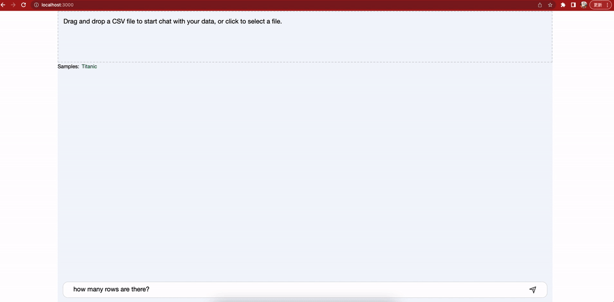
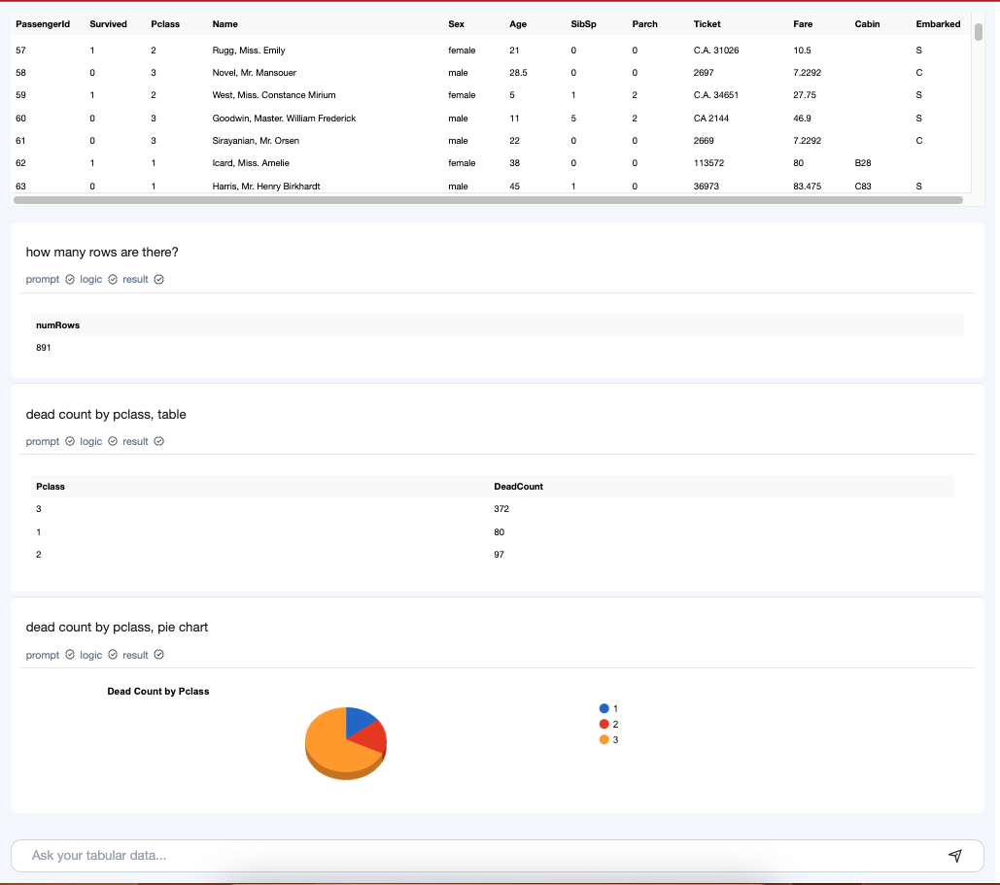

# Chat Tabular - Talking to your Tabular Data

Try in [tabular.chat](https://tabular.chat/)

### Preview


## Key workflow:
- submit a csv, got the csv header and sample lines
- call ChatGPT with prompt
- parse the result js code, and execute the function, got new Table content, then Show.

### create .env file, with 
```
REACT_APP_OPENAI_KEY=<your openai api key>
```
and run `npm run start`

Then you can play


## production
```
npm run build
```